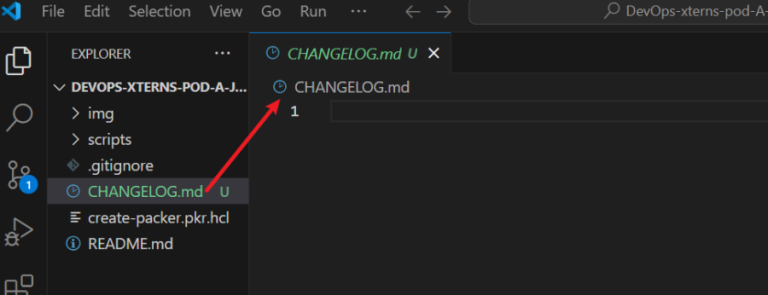

# packer-changelog
This repository maintains the CHANGELOG for tracking all updates, modifications, and improvements made to Packer configurations and templates. It follows best practices in versioning and documentation to ensure clear visibility of changes over time.

# Introduction

The packer-changelog project is designed to maintain a structured and well-documented changelog for tracking all updates, modifications, and improvements made to Packer configurations and templates. By following best practices in versioning and documentation, this repository ensures clear visibility of changes over time. The project adopts the Keep a Changelog format and adheres to Semantic Versioning, providing a standardized approach to documenting updates effectively.

## Objectives

The primary objectives of this project include:

1. Establishing a dedicated CHANGELOG.md file to record all significant changes to the Packer configurations.

2. Implementing the **Keep a Changelog format** to maintain a consistent and readable changelog.

3. Updating the `README.md` file to provide guidelines on maintaining and updating the changelog.

4. Enhancing the pull request process by integrating a checklist in the PR template to ensure changelog updates are not overlooked.

5. Streamlining version control by categorizing changes under **Added, Changed, Deprecated, Removed, Fixed, and Security sections.**

6. Facilitating collaboration and transparency among contributors by documenting every modification clearly.

## Step 1: Create the CHANGELOG.md File
In the **root directory** of the **Packer repo**, create a `CHANGELOG.md` file:

```
touch CHANGELOG.md
```


## Step 2: Add the Standard Structure to CHANGELOG.md
- Open **CHANGELOG.md** in a text editor (**e.g., VS Code, nano, or Vim):**

    

- Then, add the following content based on the **Keep a Changelog format**:

    ```
    # Changelog

    All notable changes to this project will be documented in this file.

    The format is based on [Keep a Changelog](https://keepachangelog.com/en/1.0.0/), 
    and this project adheres to [Semantic Versioning](https://semver.org/).

    ## [Unreleased]
    ### Added
    - Initial creation of the `CHANGELOG.md` file. [#<ticket-number>]

    ### Changed

    ### Deprecated

    ### Removed

    ### Fixed

    ### Security
    ```

- Save and exit

## Step 3: Update the README File
Modify `README.md` to include a section on maintaining the `changelog`.

- Open `README.md`:

- Add a section at the bottom:

    ```
    ## Changelog

    This repository follows the [Keep a Changelog](https://keepachangelog.com/en/1.0.0/) format.

    ### Updating the Changelog

    - Before merging a PR, update `CHANGELOG.md` under the relevant section.
    - Follow the format:
    - **Added**: For new features.
    - **Changed**: For modifications.
    - **Deprecated**: For soon-to-be removed features.
    - **Removed**: For now-removed features.
    - **Fixed**: For bug fixes.
    - **Security**: For security patches.
    - Reference the relevant issue or PR number.
    ```

    

- Save and exit.

## Step 4: Update the Pull Request Template
- Locate the PR template file (`.github/PULL_REQUEST_TEMPLATE.md` or `.gitlab/merge_request_templates/`) in the repo. If it does not exist, create it:

    ```
    mkdir -p .github && touch .github/PULL_REQUEST_TEMPLATE.md
    ```

    


- Open the file and Add the following:

    ```
    ## Description
    <!-- Provide a summary of the changes made in this PR -->

    ## Checklist
    - [ ] I have updated `CHANGELOG.md` under the appropriate section.
    - [ ] I have referenced the issue/ticket number in the CHANGELOG entry.
    - [ ] I have updated the documentation if necessary.
    ```

    

- Save and exit.

## Step 5: Commit the Changes
- Stage all the new and modified files:

    ```
    git add CHANGELOG.md README.md .github/PULL_REQUEST_TEMPLATE.md
    ```

    

- Commit the changes:

    ```
    git commit -m "Added CHANGELOG.md following Keep a Changelog format, updated README and PR template"
    ```

    

## Step 6: Push the Changes

- Push your branch to the remote repo:

    ```
    git push origin <your-branch-name>
    ```

    

## Step 7: Create a Pull Request

**1. Go to your Packer repo on `GitHub/GitLab`.**

**2. Click on the **"Compare & pull request"** button in the pop-up.**


**3. Review the PR Details**

  - Base branch → Usually `main`
  - Compare branch → Your feature or fix branch (e.g., `changelog-packer`).
  - **Title your PR appropriately** (e.g., `Add CHANGELOG.md & update README.md for changelog maintenance`).
  - Add a clear description explaining what this PR does. You can use the following template:
  - Scroll down and click `"Create Pull Request."`

    ```
    ## Description
    - Added a `CHANGELOG.md` file following the Keep a Changelog standard.
    - Updated the Pull Request template to remind contributors to update the changelog.
    - Ensured each changelog entry includes a date and brief description.

    ## Checklist
    - [ ] CHANGELOG.md is created and follows the correct format.
    - [ ] The PR template now includes a reminder to update the CHANGELOG.
    - [ ] All changes have been reviewed and tested.
    ```
    

- **Wait for Review & Merge**

    


## Conclusion

Maintaining a well-structured changelog is crucial for tracking the evolution of any software project. The packer-changelog repository establishes a clear and systematic approach to documenting updates using best practices in versioning and changelog management. By integrating a changelog into the development workflow and pull request process, contributors can ensure transparency, improve collaboration, and facilitate easier troubleshooting. With the implementation of Keep a Changelog and Semantic Versioning, this project enhances the overall efficiency of maintaining and deploying Packer configurations.